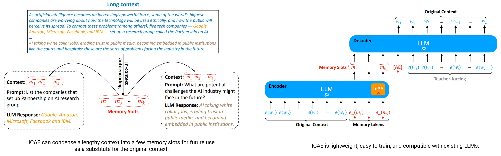

# In-context Autoencoder (ICAE)

This repository contains the code, data, and models pertaining to our paper ["In-context Autoencoder for Context Compression in a Large Language Model"](https://arxiv.org/abs/2307.06945), which has been accepted by ICLR 2024.



## Resources

* [Model](https://huggingface.co/sggetao/icae/tree/main)
* [Data](https://huggingface.co/datasets/sggetao/PwC)

## Updates

### Updated (April 2024):

Add pretrain.py, instruction_finetune.py and training_utils to icae_v2/, which can be used to train the ICAE.

### Version 2 (March 2024)
Two new ICAE models based on Mistral-7B were released. These include a pretrained model an instruction fine-tuned model. The inference code accompanying these models is also provided.

Compared with the V1 released model, the Mistral-7B ICAE models extend support to multi-span concatenation, as illustrated in Figure 6 of the paper. Also, they extend the max input length to 5120.

In the release of V2, I move the dataset and models to my [huggingface repo](https://huggingface.co/sggetao).

One can simply try the released ICAE models by running:

```
cd icae/code/icae_v2
# run the instruction fine-tuned ICAE model
bash fine_buned_inference_script.sh
# run the pretrained ICAE model
bash pretrained_inference_script.sh
```

### Version 1 (September 2023)
This is the original release of the In-context Autoencoder repository. This particular iteration includes the PwC dataset, the code, and a fine-tuned ICAE model based on Llama-2-7b-chat that is used in the paper.

The first version of the ICAE model is based in the Llama-2-7b-chat, which is used in the paper. It can be downloaded from [this link](https://huggingface.co/sggetao/icae/resolve/main/llama-2-7b-chat-finetuned-icae_zeroweight_llama2.pt). Please use the model with the code available in the [code/icae_v1](https://github.com/getao/icae/tree/main/code/icae_v1) directory.

## Cite Us

If our work contributes to your research, please cite our paper:

```bibtex
@inproceedings{
  ge2024incontext,
  title={In-context Autoencoder for Context Compression in a Large Language Model},
  author={Tao Ge and Hu Jing and Lei Wang and Xun Wang and Si-Qing Chen and Furu Wei},
  booktitle={The Twelfth International Conference on Learning Representations},
  year={2024},
  url={https://openreview.net/forum?id=uREj4ZuGJE}
}
```
